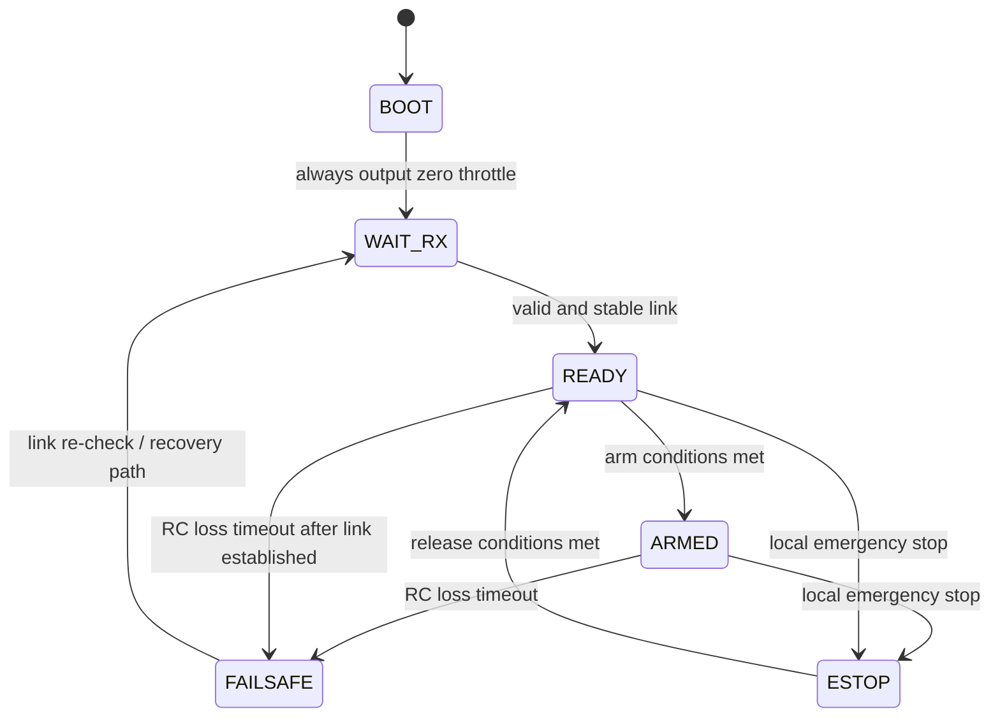
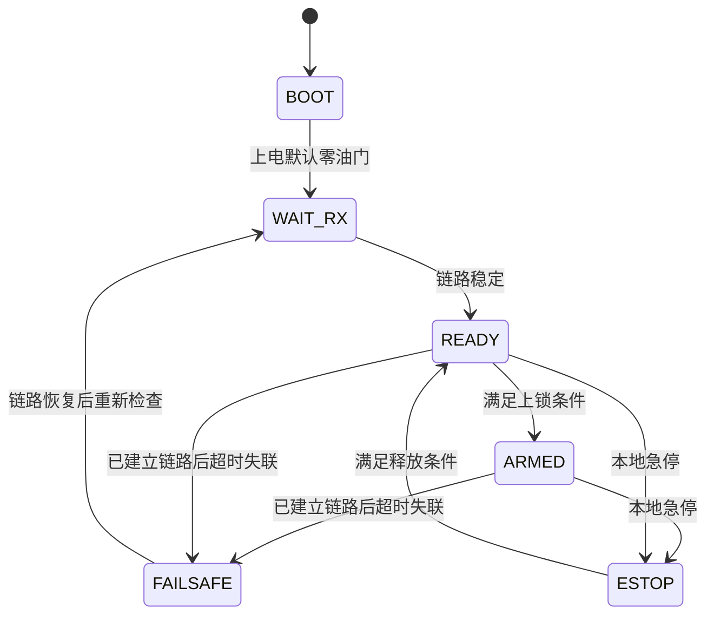

中文版本在后面

<div align="center">

# STM32_ESC_Telemetry_Test

**Single-motor bench ESC controller firmware for `STM32F103C8T6 (Blue Pill)`**

<p>
  
  
  
  
  
</p>

</div>

> This project is built on STM32CubeMX/HAL and reuses stable low-level modules from the E1 project, then adds ELRS/CRSF input, arm/disarm logic, failsafe, DShot output, OLED display, HC-05 telemetry, and bench safety protections.

---

# Table of Contents

- [English](#english)
  - [1. Project Status](#1-project-status)
  - [2. Key Features](#2-key-features)
  - [3. Hardware Mapping](#3-hardware-mapping)
  - [4. Software Architecture](#4-software-architecture)
  - [5. Main Runtime States](#5-main-runtime-states)
  - [6. RC Mapping and Defaults](#6-rc-mapping-and-defaults)
  - [7. Motor Output Policy](#7-motor-output-policy)
  - [8. Protection Logic (Software-side)](#8-protection-logic-software-side)
  - [9. Receiver Path and Reliability Notes](#9-receiver-path-and-reliability-notes)
  - [10. Telemetry and Debug](#10-telemetry-and-debug)
  - [11. Build](#11-build)
  - [12. Flash / Debug (VS Code)](#12-flash--debug-vs-code)
  - [13. Quick Bring-up Checklist](#13-quick-bring-up-checklist)
  - [14. Limitations](#14-limitations)
  - [15. Version Tag](#15-version-tag)
- [中文](#中文)
  - [1. 项目状态](#1-项目状态)
  - [2. 主要功能](#2-主要功能)
  - [3. 硬件引脚分配](#3-硬件引脚分配)
  - [4. 软件结构](#4-软件结构)
  - [5. 运行状态](#5-运行状态)
  - [6. 通道映射与默认参数](#6-通道映射与默认参数)
  - [7. 电机输出策略](#7-电机输出策略)
  - [8. 软件保护逻辑](#8-软件保护逻辑)
  - [9. 接收链路可靠性说明](#9-接收链路可靠性说明)
  - [10. 调试与状态输出](#10-调试与状态输出)
  - [11. 构建](#11-构建)
  - [12. 下载与调试（VS Code）](#12-下载与调试vscode)
  - [13. 快速上电检查](#13-快速上电检查)
  - [14. 当前限制](#14-当前限制)
  - [15. 版本标签](#15-版本标签)

---

# English

## 1. Project Status

| Item | Value |
|---|---|
| Release status | `V1.0` (first usable version) |
| Target use case | FYP bench demo (single ESC + single motor) |
| Control source | ELRS receiver via `CRSF` on `USART2` |
| Motor output | DShot on `PB8 (TIM4_CH3 + DMA)` |

---

## 2. Key Features

### Control and RC Input
- ELRS/CRSF RC input (`420000 baud`, USART2)
- RC throttle + arm switch control
- Arm/disarm state machine with safety gates
- Receiver timeout failsafe

### Motor Output and Safety
- DShot motor command output (single channel)
- Local key emergency stop latch / release
- ADC + DMA bus voltage/current monitoring
- ESC-side software protections (overcurrent/overvoltage/regen related)

### UI and Debug
- OLED runtime status page (`I2C1`, SSD1306 128x64)
- HC-05 debug/status link (`USART1`, 9600)

---

## 3. Hardware Mapping

**Board:** `STM32F103C8T6 Blue Pill`

| Pin | Function |
|---|---|
| `PA0` | ADC current input |
| `PA1` | ADC voltage input |
| `PA2/PA3` | USART2 (ELRS/CRSF) |
| `PA9/PA10` | USART1 (HC-05) |
| `PB6/PB7` | I2C1 (OLED) |
| `PB8` | ESC DShot output (`TIM4_CH3`) |
| `PB12` | HC-05 STATE |
| `PB13` | USER KEY |
| `PC13` | USER LED |

---

## 4. Software Architecture

Code is organized by responsibility:

### `app/`
- high-level state machine and behavior
- CRSF parsing and RC data handling
- arm/disarm/failsafe logic
- motor command mapping and protections
- display model

### `bsp/`
- HC-05 transport and command parsing
- key debounce and event
- ADC monitor and derived values
- DShot low-level driver
- OLED low-level driver

### `Core/`
- CubeMX-generated startup and HAL integration

### `Drivers/`
- STM32 HAL + CMSIS

### Project Layout

```text
STM32_ESC_Telemetry_Test/
├─ app/
│  ├─ inc/
│  └─ src/
├─ bsp/
│  ├─ inc/
│  └─ src/
├─ Core/
├─ Drivers/
├─ .vscode/
└─ build/
```

---

## 5. Main Runtime States

- `BOOT`
- `WAIT_RX`
- `READY`
- `ARMED`
- `FAILSAFE`
- `ESTOP`

**High-level behavior:**
- boot -> always output zero throttle
- no valid RC frames -> `WAIT_RX`
- valid and stable link -> `READY`
- arm conditions met -> `ARMED`
- RC loss timeout after link established -> `FAILSAFE`
- local emergency stop -> `ESTOP`

### State Flow



---

## 6. RC Mapping and Defaults

Defined in `app/inc/app_config.h`:

| Item | Value |
|---|---|
| throttle channel | `CH3` |
| arm switch channel | `CH5` |
| RC endpoint model | `988us ~ 2012us` |
| low-throttle threshold | `1050us` |

**arm switch thresholds**
- OFF <= `1300us`
- ON >= `1700us`

---

## 7. Motor Output Policy

Current default policy is bench-friendly:

| Condition | Output |
|---|---|
| disarmed | `DShot = 0` |
| armed + low throttle | `DShot = 0` |
| throttle above low threshold | mapped output |
| demo max command default | `DShot 1800` |

Additional behavior:
- output slew limiting enabled (up/down rate limits)

---

## 8. Protection Logic (Software-side)

Motor control includes conservative protection checks:

- soft current clamp behavior
- hard overcurrent trip
- overvoltage trip
- regen-like negative current trip
- latch and release conditions

> [!NOTE]
> these protections help reduce risk but do not replace ESC hardware protections

> [!WARNING]
> bench test should always be performed with proper safety precautions

---

## 9. Receiver Path and Reliability Notes

Current RX implementation:

- USART2 RX DMA in circular mode
- CRSF byte stream parsed continuously
- avoids restart windows from stop/restart receive patterns

HC-05 status transmission is asynchronous (non-blocking queue) to avoid long loop stalls at `9600 baud`.

---

## 10. Telemetry and Debug

HC-05 periodic status line includes fields such as:

- `state`, `rx`, `link`, `arm`, `arm_sw`
- `tl` (throttle low gate), `seen` (switch-off seen flag)
- `drop` (arm drop reason)
- `thr_us`, `arm_us`, `dshot`
- `prot`, `reason`, `trip`
- `vf`, `ce`, `se`, `ue` (CRSF diagnostics)

Supported HC-05 commands:
- `STATUS`
- `STOP`

---

## 11. Build

```bash
cmake --preset Debug
cmake --build --preset Debug
```

**Main output**
- `build/Debug/STM32_ESC_Telemetry_Test.elf`

---

## 12. Flash / Debug (VS Code)

Workspace contains `.vscode` tasks and launch configs for ST-Link workflow:

- build + debug launch
- standalone flash task using STM32 tools

---

## 13. Quick Bring-up Checklist

- [ ] Verify wiring (especially ESC signal now on `PB8`)
- [ ] Power up with prop-safe condition
- [ ] Confirm HC-05 status reports `rx=1`, `link=1`
- [ ] Confirm arm switch channel reads expected values (`arm_us`)
- [ ] Arm with low throttle
- [ ] Increase throttle gradually and observe current/voltage/protection fields

---

## 14. Limitations

- single motor only
- no full flight-control stack
- no closed-loop RPM control
- parameter tuning currently compile-time via headers

---

## 15. Version Tag

This first stable bench-usable release is tagged as:

- `V1.0`

---

# 中文

## 1. 项目状态

| 项目 | 内容 |
|---|---|
| 发布状态 | `V1.0`（第一版可用版本） |
| 目标场景 | 毕业设计台架单电机演示 |
| 控制输入 | `USART2` 接 ELRS/CRSF |
| 电机输出 | `PB8 (TIM4_CH3 + DMA)` 输出 DShot |

---

## 2. 主要功能

### 控制与接收
- ELRS/CRSF 接收（`420000 baud`）
- 油门通道 + ARM 开关通道控制
- ARM/DISARM 状态机
- 接收机超时 failsafe

### 电机输出与安全
- 单路 DShot 电调控制
- 本地按键急停锁存
- ADC+DMA 母线电压/电流采样
- 软保护逻辑（过流/过压/回灌相关）

### 显示与调试
- OLED 实时状态显示（`I2C1`）
- HC-05 串口状态输出与指令

---

## 3. 硬件引脚分配

**开发板：** `STM32F103C8T6 Blue Pill`

| 引脚 | 功能 |
|---|---|
| `PA0` | 电流 ADC 输入 |
| `PA1` | 电压 ADC 输入 |
| `PA2/PA3` | USART2（ELRS/CRSF） |
| `PA9/PA10` | USART1（HC-05） |
| `PB6/PB7` | I2C1（OLED） |
| `PB8` | ESC DShot 输出（`TIM4_CH3`） |
| `PB12` | HC-05 STATE |
| `PB13` | 用户按键 |
| `PC13` | 用户 LED |

---

## 4. 软件结构

### `app/`
- 顶层流程与状态机
- CRSF 解析
- ARM/DISARM/failsafe 逻辑
- 油门映射与电机保护
- 显示模型

### `bsp/`
- HC-05 通信与命令
- 按键去抖
- ADC 监测
- DShot 底层
- OLED 底层

### `Core/`
- CubeMX 生成代码

### `Drivers/`
- STM32 HAL/CMSIS

### 项目结构

```text
STM32_ESC_Telemetry_Test/
├─ app/
│  ├─ inc/
│  └─ src/
├─ bsp/
│  ├─ inc/
│  └─ src/
├─ Core/
├─ Drivers/
├─ .vscode/
└─ build/
```

---

## 5. 运行状态

- `BOOT`
- `WAIT_RX`
- `READY`
- `ARMED`
- `FAILSAFE`
- `ESTOP`

**状态流转简述：**
- 上电默认零油门
- 无有效接收帧 -> `WAIT_RX`
- 链路稳定 -> `READY`
- 满足上锁条件 -> `ARMED`
- 已建立链路后超时失联 -> `FAILSAFE`
- 本地急停 -> `ESTOP`

### 状态机流程



---

## 6. 通道映射与默认参数

配置文件：`app/inc/app_config.h`

| 项目 | 内容 |
|---|---|
| 油门通道 | `CH3` |
| ARM 开关通道 | `CH5` |
| 通道端点模型 | `988us ~ 2012us` |
| 低油门阈值 | `1050us` |

**ARM 开关阈值**
- OFF <= `1300us`
- ON >= `1700us`

---

## 7. 电机输出策略

当前默认策略（更适合台架）：

| 条件 | 输出 |
|---|---|
| 未上锁 | `DShot=0` |
| 已上锁但油门最低 | `DShot=0` |
| 油门超过低阈值后 | 开始输出映射 |
| 演示最大输出默认 | `DShot 1800` |

附加行为：
- 启用了输出斜率限制（升降速限幅）

---

## 8. 软件保护逻辑

电机控制里包含保守保护：

- 软限流行为
- 硬过流跳闸
- 过压跳闸
- 回灌类负电流跳闸
- 锁存与释放条件

> [!NOTE]
> 这些保护是辅助保护，不能替代 ESC 硬件保护

> [!WARNING]
> 台架测试请始终保持安全操作

---

## 9. 接收链路可靠性说明

当前接收实现：

- USART2 DMA 环形接收
- 持续解析 CRSF 字节流
- 避免 stop/restart 接收窗口导致的丢字节

HC-05 状态发送已改为异步非阻塞队列，避免 `9600` 波特率阻塞主循环。

---

## 10. 调试与状态输出

HC-05 状态行包含：

- `state`, `rx`, `link`, `arm`, `arm_sw`
- `tl`（低油门门限判定）, `seen`（是否见过开关 OFF）
- `drop`（退臂原因）
- `thr_us`, `arm_us`, `dshot`
- `prot`, `reason`, `trip`
- `vf`, `ce`, `se`, `ue`（CRSF 诊断）

HC-05 支持命令：
- `STATUS`
- `STOP`

---

## 11. 构建

```bash
cmake --preset Debug
cmake --build --preset Debug
```

**主要产物**
- `build/Debug/STM32_ESC_Telemetry_Test.elf`

---

## 12. 下载与调试（VS Code）

仓库已包含 `.vscode` 配置，可用于 ST-Link 构建/下载/调试流程。

- build + debug launch
- standalone flash task using STM32 tools

---

## 13. 快速上电检查

- [ ] 确认 ESC 信号线接在 `PB8`
- [ ] 上电前保证安全环境（无桨或安全夹具）
- [ ] 观察 HC-05 是否 `rx=1`, `link=1`
- [ ] 检查 `arm_us` 是否随开关变化
- [ ] 低油门执行 ARM
- [ ] 逐步加油并观察电压/电流/保护状态

---

## 14. 当前限制

- 仅单电机
- 非完整飞控
- 无闭环转速控制
- 参数主要通过头文件编译期配置

---

## 15. 版本标签

第一版可用版本标签：

- `V1.0`
